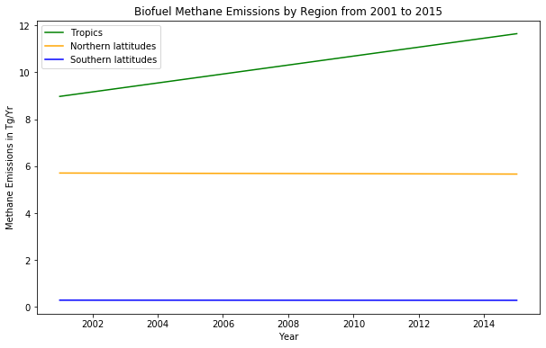

```python
import numpy
```


```python
from matplotlib import pyplot, axes
```


```python
year=([2001,2015])
tropics=([8.9726,11.64400])
north=([5.7088,5.66426])
south=([.2923,.28655])
pyplot.plot(year,tropics,color='green')
pyplot.plot(year,north,color='orange')
pyplot.plot(year,south,color='blue')
pyplot.legend(['Tropics','Northern lattitudes','Southern lattitudes'])
pyplot.xlabel('Year')
pyplot.ylabel('Methane Emissions in Tg/Yr')
pyplot.title('Biofuel Methane Emissions by Region from 2001 to 2015')
pyplot.rcParams['figure.figsize']=(4,3)
```





```python

```
